  
   
  

## 🧭 关于我

- 🔭 12 年研发经验，现聚焦 **AI Agent 落地**：Agent Harness（Pi）· MCP & Skill 工程化 · LangChain / LangGraph
- 🌱 从 0 到 1 搭建过高并发业务系统与数据平台
- 🛠️ 独立开发多款 AI 产品：AI 模拟面试、AI 十万个为什么 · 有声绘本 🐰、AI 发型试戴（iOS）、Chrome 扩展等
- 🗂️ 查看全部作品集 → [limbo101.win/#works](https://limbo101.win/#works)
- ✍️ 输出 [**agent-dev-101**](https://github.com/limboinf/agent-dev-101)：55 天 AI Agent 学习计划，40+ 篇深度笔记
- 🪪 Open to：AI Agent / 全栈 / 后端 → [pythonsuper@gmail.com](mailto:pythonsuper@gmail.com)

## 🚀 精选项目

| 项目 | 简介 |
| ---- | ---- |
| [**cogni**](https://github.com/limboinf/cogni) | 基于大模型的智能知识库与知识图谱智能体开发平台 |
| [**bitlab-agent**](https://github.com/limboinf/bitlab-agent) | Local-first、Pi 驱动的 AI Agent 工作区（Desktop + WebUI） |
| [**liteparse-agentic-studio**](https://github.com/limboinf/liteparse-agentic-studio) | PDF / 扫描件 / Word → RAG-ready Markdown：LiteParse + PaddleOCR + Qwen VLM 混合解析管道 |
| [**funasr-transcribe-skill**](https://github.com/limboinf/funasr-transcribe-skill) | 基于 FunASR 的本地、免费、高效语音识别工具 |
| [**agent-dev-101**](https://github.com/limboinf/agent-dev-101) | AI Agent 系统开发教程：Function Calling → ReAct → RAG → LangGraph → MCP |
| [**xiaoyuzhoufm**](https://github.com/limboinf/xiaoyuzhoufm) | 小宇宙播客音频下载器 |

## 🧰 技术栈

## 🐍 持续更新中

  <picture>
    <source media="(prefers-color-scheme: dark)" srcset="https://raw.githubusercontent.com/limboinf/limboinf/output/github-contribution-grid-snake-dark.svg" />
    
  </picture>

## 🤝 联系我

  
  
  

  

